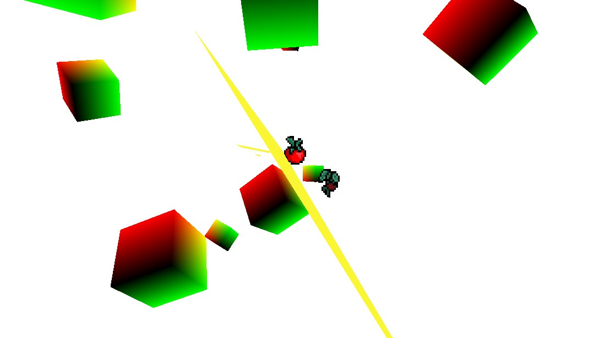

# SoraGL-Python

SoraGL is a python based game-engine created to be simple and easy to learn and use. 

ALTHOUGH: this project is mainly made to suite personal use cases but is open to third-party criticism or use!

`Note:` most production/testing is performed on the `#master` branch | not the `#main` branch

## Readme Overview

| Link | Description |
| --- | --- |
| [About](#about) | about the engine + what it is |
| [Installation](#installation) | how to install |
| [Usage](#usage) | how to use engine |
| [Contributing](#contributing) | contributing to code! |
| [License](#license) | licensing |

# About

soragl is a game engine that uses the `pygame` and `moderngl` modules to streamline game development for smaller indie game developers. 

---

# Installation

- to complete

TLDR:

1. clone git repository
2. engine files are located in `soragl`
3. everything else is customizable!
4. to start using the `soragl` package, just `import soragl as SORA`

--- 

# Usage

If you're wondering how to use the engine, well.. I have yet to make documentation!
- anyone who wants to write documentation for this engine
- feel free to follow the `contribution` steps below!

---

# Contributing
Simple outline:

1. Pitch the feature / fix you want to add in the `issues` tab

2. If approved, fork the project

3. Create your feature branch 

(`git checkout -b feature/AmazingFeature`)

4. Commit your changes 

(`git commit -m 'Add some AmazingFeature'`)

5. Push to the branch 

(`git push origin feature/AmazingFeature`)

6. Open a pull request

---

# License

[MIT](https://choosealicense.com/licenses/mit/)

---

# Contact

feel free to contact me on 
- discord at: `Ultrasword#7313`

